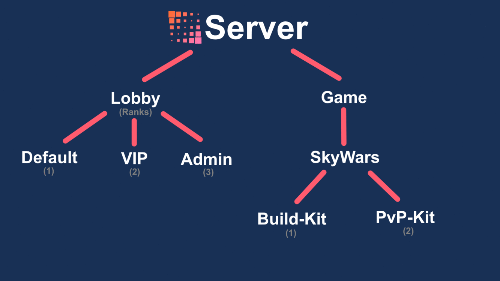

## Overview

Event listening is a fairly hard part to keep easy while having a clear understanding of the execution flow. In Minestom, a tree is used to define inheritance for filtering and extensibility. Each node of the tree contains:

* Event class, where only subclasses are allowed to enter (`Event`/`PlayerEvent`/etc...)
* Condition for filtering
* List of listeners
* Name for identification
* Priority



The tree structure provides us many advantages:

* Context-aware listeners due to node filtering
* Clear execution order
* Ability to store the event tree as an image for documentation purpose
* Listener injection into existing nodes

## API

### Node

```java
// Can listen to any Event, without any condition
EventNode<Event> node = EventNode.all("demo");
// Can only listen to entity events
EventNode<EntityEvent> entityNode = EventNode.type("entity-listener", EventFilter.ENTITY);
// Can only listen to player events
EventNode<PlayerEvent> playerNode = EventNode.type("player-listener", EventFilter.PLAYER);
// Listen to player events with the player in creative mode
EventNode<PlayerEvent> creativeNode = EventNode.value("creative-listener", EventFilter.PLAYER, Player::isCreative);
```

Each node needs a name to be debuggable and be retrieved later on, an `EventFilter` containing the event type target and a way to retrieve its actor (i.e. a `Player` from a `PlayerEvent`). All factory methods accept a predicate to provide an additional condition for filtering purposes.

### Listener

```java
EventNode<Event> node = EventNode.all("demo");
node.addListener(EntityTickEvent.class, event -> {
    // Inline listener
});
node.addListener(EventListener.builder(EntityTickEvent.class)
    .expireCount(50) // Stop after 50 executions
    .expireWhen(event -> event.getEntity().isGlowing()) // Stop once the predicate returns true
    .handler(entityTickEvent ->
        System.out.println("Entity tick!"))
    .build());

EventNode<PlayerEvent> playerNode = EventNode.type("player-listener", EventFilter.PLAYER);
// playerNode.addListener(EntityTickEvent.class, event -> {}); -> does not work as playerNode only accept player events
playerNode.addListener(PlayerTickEvent.class, event -> {});
```

### Child

Children take the condition of their parent and are able to append to it.

```java
EventNode<Event> node = EventNode.all("demo");
EventNode<PlayerEvent> playerNode = EventNode.type("player-listener", EventFilter.PLAYER);

node.addChild(playerNode); // Works as PlayerEvent is also an Event

// playerNode.addChild(node); -> Doesn't compile as the parent would be more restrictive than the child
```

### Event execution

Events can be executed from anywhere, not only the root node.

```java
EventNode<Event> node = EventNode.all("demo");
node.call(new MyEvent());
```

## In practice

Now that you are familiar with the API, here is how you should use it inside your Minestom project.

### Node to use 

#### Server JAR

The root node of the server can be retrieved using `MinecraftServer#getGlobalEventHandler()`, you can safely insert new nodes.

```java
var handler = MinecraftServer.getGlobalEventHandler();
handler.addListener(PlayerChatEvent.class,
        event -> event.getPlayer().sendMessage("You sent a message!"));
var node = EventNode.all("demo");
node.addListener(PlayerMoveEvent.class,
        event -> event.getPlayer().sendMessage("You moved!"));
handler.addChild(node);
```

#### Extensions

Extensions should use their defined node from `Extension#getEventNode()`, which is removed from the root node once unloaded. Listeners inserted to external nodes must be removed manually.

### Structure

Having an image of your tree is highly recommended, for documentation purposes and ensuring an optimal filtering path. It is then possible to use packages for major nodes, and classes for minor filtering.

```java
Server/
   Global.java
   Lobby/
      Rank/
         - AdminRank.java
         - VipRank.java
      - DefaultRank.java
   Game/
      Bedwars/
         Kit/
            PvpKit.java
            BuildKit.java
         Bedwars.java
      Skywars/
         Kit/
            PvpKit.java
            BuildKit.java
         Skywars.java
```

### Custom event

`Event` is an interface that you can freely implement, traits like `CancellableEvent` (to stop the execution after a certain point) and `EntityEvent` (telling the dispatcher that the event contains an entity actor) are also present to ensure your code will work with existing logic. You can then choose to run your custom event from an arbitrary node (see [example](#event-execution)), or from the root with `EventDispatcher#call(Event)`.
